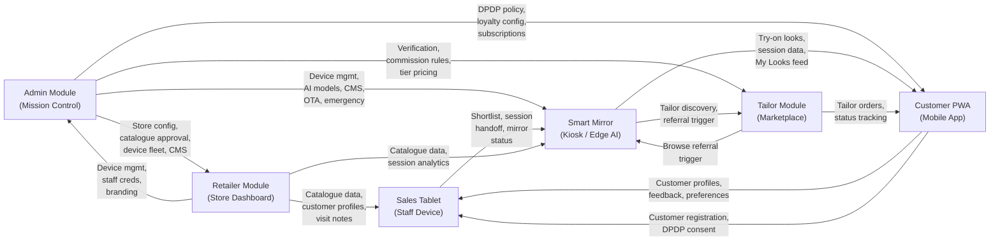

# Wearify Platform — Module Architecture & Admin Module Implementation Plan

## Platform Overview

Wearify is an AI-powered virtual try-on platform for Indian saree retailers. The system architecture (from the Figma diagram) consists of **6 interconnected modules**:



---

## Module Breakdown (All 6)

### 1. Admin Module (Mission Control) — **PRIMARY FOCUS**
The central command center that manages the entire platform. Contains 18 navigation sections:

| Section | Key | Description |
|---------|-----|-------------|
| AI Dashboard | `dash` | Revenue charts, health radar, error budget, unit economics, AI predictions, system health, cost monitor, API gateway metrics, analytics |
| Command Center | `cmd` | Emergency actions, incident log, escalation matrix |
| Stores | `str` | Store registry, onboarding wizard (8-step), store detail/manage, tailors, content, field ops, deployment, health config, catalog QA, training |
| Devices | `dev` | Fleet management, IoT shadow viewer, provisioning, shipping tracker, offline queue |
| AI Agents | `agt` | Agent control plane (8 agents), tool registry (15 tools), conflict resolution, agent vs human comparison |
| AI Models | `mdl` | Model registry & MLOps, prompt versioning, OTA rollout pipeline, training pipeline, dataset health, feature store |
| Revenue | `rev` | 7 revenue streams, discounts, sales pipeline, referrals, forecast, promoted placements, commissions, white-label |
| Billing & Tax | `bil` | Invoicing, GST compliance, SLA credits, annual plans, subscriptions |
| Network Intel | `net` | India map, trending, regional demand, benchmarks, manufacturer insights, report builder |
| Support | `sup` | Tickets (AI root cause), support channels, knowledge base, NPS, monthly check-ins |
| Legal | `leg` | Agreements, document repository, customer terms, AUP, IP portfolio, regulatory compliance, disputes |
| Security | `sec` | API keys, RBAC (7 roles), CERT-In compliance, network security, sessions, role events |
| Data Governance | `dgv` | Camera/CV privacy, retention policies, consent registry, data classification, masking, archival, data residency, governance controls |
| Vendors | `vnd` | Vendor registry, webhook health, DLQ monitor |
| Audit Trail | `aud` | Immutable audit log, broadcast messaging, store communications |
| OTA & Releases | `ota` | Feature flags, CI/CD, deploy freeze, data export, Ansible playbooks, release management |
| DR & Resilience | `drc` | Backup health, DR drills, environment registry, Terraform state, runbooks |
| Settings | `cfg` | Platform config, WhatsApp templates, notification rules, festival calendar, changelog, on-call rotation, languages |

### 2. Retailer Module (Store Dashboard)
Store owner/manager-facing dashboard. Receives data from Admin (store config, catalogue approval). Sends back session analytics, staff management.

### 3. Sales Tablet (Staff Device)
In-store tablet for salespersons. Receives catalogue data, customer profiles from Retailer Module. Manages shortlists, session handoff to Smart Mirror.

### 4. Smart Mirror (Kiosk / Edge AI)
The edge computing device running Jetson Orin NX. Receives catalogue data, AI models via OTA, and session analytics. Runs VTON, PoseNet, SkinTone analysis on-device.

### 5. Customer PWA (Mobile App)
Customer-facing progressive web app. Shows try-on looks, session history, "My Looks" feed. Handles DPDP consent, WhatsApp sharing.

### 6. Tailor Module (Marketplace) 
Tailor marketplace for blouse referrals (Revenue Stream 1). Receives referral triggers from Smart Mirror, manages tailor orders and status tracking.

---

## Questions Before Proceeding

> [!IMPORTANT]
> Before I start implementation, I need clarification on several points to avoid mismatches:

### Architecture & Scope

1. **Auth Strategy**: The project has Better Auth scaffolded. For the Admin Module, should we use Better Auth with email/password + TOTP (as shown in the demo login screen), or do you want a simpler auth approach first? The demo shows `admin@phygifyt.com` with TOTP.

2. **Styling Approach**: The static demo uses all inline styles with a warm beige/brown color palette (`#FBF8F3`, `#71221D`, etc.). The project has TailwindCSS v4 installed. Should I:
   - (A) Use TailwindCSS with a custom design system matching the demo's warm palette? 
   - (B) Use vanilla CSS matching the demo exactly?
   - (C) Use a different design approach altogether?

3. **Recharts / Charts**: The demo uses `recharts` for all charts (Area, Radar, Line, Bar, Pie). Should I keep Recharts or would you prefer a different charting library?

4. **Phase 1 Scope**: The Admin Module has 18 sections. For the initial implementation, which sections are **highest priority**? My suggestion for Phase 1:
   - Dashboard (Overview + System Health tabs)
   - Stores (Registry + Onboarding Wizard)
   - Devices (Fleet + Detail view)
   - Settings (Platform Config + Feature Flags)
   - Audit Trail
   
   Or do you want all 18 sections in Phase 1?

5. **Data Seeding**: The demo has extensive mock data (STORES, DEVS, AGTS, MDLS, etc.). Should I create Convex seed scripts to populate the database with this demo data so it looks production-ready on first load?

6. **Real-time Features**: Convex provides real-time subscriptions. Which features need real-time updates? For example:
   - Device online/offline status (via IoT heartbeat)
   - Live session count
   - Ticket status changes
   - Or should everything be real-time by default (Convex's strength)?

7. **File Storage**: The onboarding wizard requires file uploads (Aadhaar, PAN, GST, store photos, legal docs). Should I use Convex file storage for this, or integrate with S3 directly?

---

## Proposed Implementation Plan — Admin Module Phase 1

### Phase 1a: Foundation (Core Infrastructure)

#### Convex Schema & Backend

##### [NEW] [convex/schema.ts](file:///home/vrathik/wearify-claude/wearify/convex/schema.ts) — Full schema design
Core tables needed for the Admin Module:
- `stores` — Store registry with all profile, KYC, agreements, plan, health data
- `devices` — Device fleet (mirrors, tablets) with telemetry, lifecycle status
- `staff` — Staff members with roles, credentials, store assignment
- `agents` — AI agent registry with mode, status, accuracy, cost tracking
- `agentTools` — Tool registry for agents
- `models` — AI model registry with version, accuracy, drift metrics
- `tickets` — Support tickets with AI diagnosis
- `invoices` — Billing & invoicing records
- `vendors` — Vendor registry
- `auditLog` — Immutable audit trail (append-only)
- `featureFlags` — Feature flag configuration
- `platformConfig` — Platform-level settings (key-value)
- `legalDocs` — Legal document repository
- `tailors` — Tailor marketplace registry
- `notificationRules` — Notification rules engine
- `festivals` — Festival calendar with deploy freeze
- `changelog` — Platform changelog entries
- `onCallRotation` — On-call schedule
- `waTemplates` — WhatsApp message templates
- `sessions` — Live mirror sessions
- `incidents` — Incident log
- `kbArticles` — Knowledge base articles
- `retentionPolicies` — Data retention policies
- `roleEvents` — Role change audit trail

##### [NEW] Convex Functions (organized by domain):
- `convex/stores.ts` — CRUD for stores, onboarding workflow
- `convex/devices.ts` — Device fleet management, telemetry
- `convex/agents.ts` — Agent CRUD, pause/resume, conflict management
- `convex/billing.ts` — Invoice generation, payment tracking
- `convex/audit.ts` — Audit log (append-only mutations)
- `convex/settings.ts` — Platform config, feature flags, festivals
- `convex/support.ts` — Tickets, KB articles
- `convex/security.ts` — API keys, role management
- `convex/seed.ts` — Database seeding with demo data

---

#### Frontend App Shell

##### [NEW] App Layout & Routing (Next.js App Router)
```
app/
├── admin/
│   ├── layout.tsx          — Admin shell (sidebar nav + topbar)
│   ├── page.tsx            — Redirects to /admin/dashboard
│   ├── dashboard/
│   │   └── page.tsx        — AI Dashboard (Overview, System Health, Cost, API, Analytics tabs)
│   ├── command-center/
│   │   └── page.tsx        — Emergency Command Center
│   ├── stores/
│   │   ├── page.tsx        — Store Registry + tabs
│   │   ├── [id]/
│   │   │   └── page.tsx    — Store detail + manage
│   │   └── onboard/
│   │       └── page.tsx    — 8-step onboarding wizard
│   ├── devices/
│   │   ├── page.tsx        — Device fleet + tabs
│   │   └── [id]/
│   │       └── page.tsx    — Device detail (telemetry, lifecycle)
│   ├── agents/
│   │   └── page.tsx        — AI Agent Control Plane
│   ├── models/
│   │   └── page.tsx        — AI Model Registry
│   ├── revenue/
│   │   └── page.tsx        — Revenue Intelligence
│   ├── billing/
│   │   └── page.tsx        — Billing, Tax & Invoicing
│   ├── network/
│   │   └── page.tsx        — Network Intelligence
│   ├── support/
│   │   └── page.tsx        — Support & AI Diagnosis
│   ├── legal/
│   │   └── page.tsx        — Legal, Contracts & IP
│   ├── security/
│   │   └── page.tsx        — Security & Access
│   ├── data-governance/
│   │   └── page.tsx        — Data Governance & CV Privacy
│   ├── vendors/
│   │   └── page.tsx        — Vendor & Infrastructure
│   ├── audit/
│   │   └── page.tsx        — Audit Trail & Communications
│   ├── releases/
│   │   └── page.tsx        — OTA, Features & Releases
│   ├── resilience/
│   │   └── page.tsx        — DR & Resilience
│   └── settings/
│       └── page.tsx        — Settings (Config, WhatsApp, Notifications, etc.)
```

##### [NEW] Shared UI Components:
- `components/admin/` — Admin-specific layout components
  - `Sidebar.tsx` — Left navigation with all 18 sections
  - `Topbar.tsx` — Top bar with user info, time, notifications
- `components/ui/` — Reusable primitives from the demo
  - `Badge.tsx`, `KPI.tsx`, `Card.tsx`, `Row.tsx`, `Btn.tsx`
  - `Metric.tsx`, `Toggle.tsx`, `Tabs.tsx`
  - `Inp.tsx`, `Sel.tsx`, `FileUp.tsx`, `Chk.tsx`

---

### Phase 1b: Core Pages (Priority Sections)

1. **Dashboard** — KPI cards, Revenue chart, Health radar, Error budget, Unit economics
2. **Stores** — Full store registry + 8-step onboarding wizard + store detail
3. **Devices** — Fleet view + device detail with telemetry
4. **Settings** — Feature flags, platform config, WhatsApp templates
5. **Audit Trail** — Immutable log viewer

### Phase 1c: Remaining Admin Sections

All other 13 sections filled in with real Convex queries/mutations.

---

## Verification Plan

### Browser Testing
- Navigate to `/admin/dashboard` → verify KPI cards and charts render
- Navigate to `/admin/stores` → verify store list loads from Convex
- Click "+ Onboard New Store" → complete all 8 wizard steps
- Navigate to `/admin/devices` → verify device fleet renders
- Click a device → verify detail page with telemetry
- Toggle feature flags in `/admin/settings` → verify persistence

### Manual Verification
- I will run `pnpm dev` to start both Next.js and Convex dev servers
- Open the browser to verify each page renders correctly
- Test CRUD operations: create a store, add a device, update settings
- Verify real-time: open two tabs, make a change in one, see it reflect in the other

> [!NOTE]
> The verification plan will be expanded once we agree on Phase 1 scope and auth strategy.
